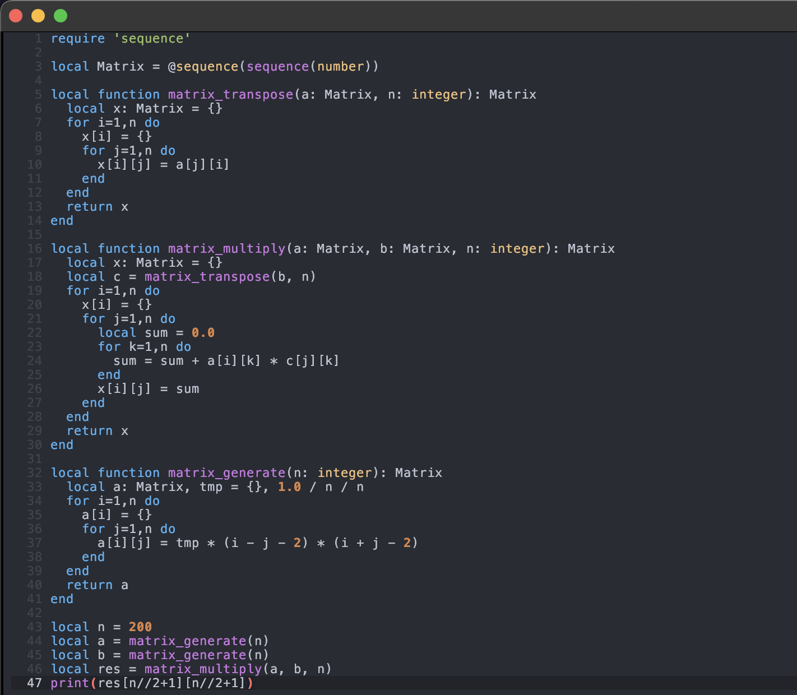

# Nelua Emacs Syntax Highlighter

This package provides syntax highlighting for [Nelua](https://nelua.io/) language source files in GNU Emacs. With this mode, writing and reading Nelua code in Emacs becomes more visually pleasant and error-resistant.

## Features

- Syntax highlighting for Nelua keywords, comments, strings, functions, and more
- Basic filetype detection for `.nelua` files
- Easily extensible for more features

## Installation

1. **Manual installation:**  
   Download `nelua.el` and place it in your Emacs `load-path`.

2. **Add to your `.emacs` or `init.el`:**
   ```elisp
   (require 'nelua-mode)
   (add-to-list 'auto-mode-alist '("\\.nelua\\'" . nelua-mode))
   ```

## Usage

Open any `.nelua` file in Emacs. Syntax highlighting should be automatically enabled.  
You can also manually enable the mode with:
```
M-x nelua-mode
```

## Screenshot

Below is a screenshot of nelua-mode in action:



## Contributing

Pull requests, feature suggestions, and bug reports are welcome!

## License

[MIT](LICENSE)
